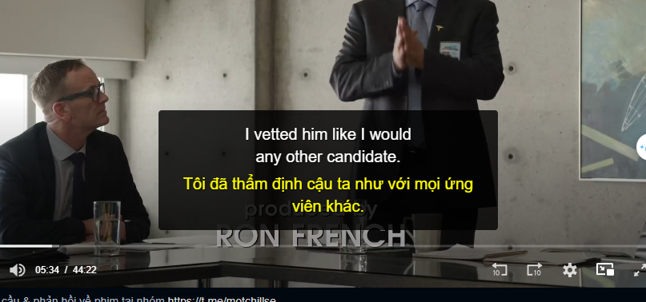

# Chrome_Extension_Subtitle

**Save Files:** Save all the files (manifest.json, content.js, popup.html, popup.js, style.css) in a new folder.

**Open Chrome Extensions:** Go to chrome://extensions/ in your Chrome browser.

**Enable Developer Mode:** Turn on the "Developer mode" toggle in the top right corner.

**Load Unpacked Extension:** Click the "Load unpacked" button and select the folder where you saved your extension files.

**Test on a Video:** Go to a website with a video (e.g., YouTube), click the extension icon, select an SRT file, and play the video.

